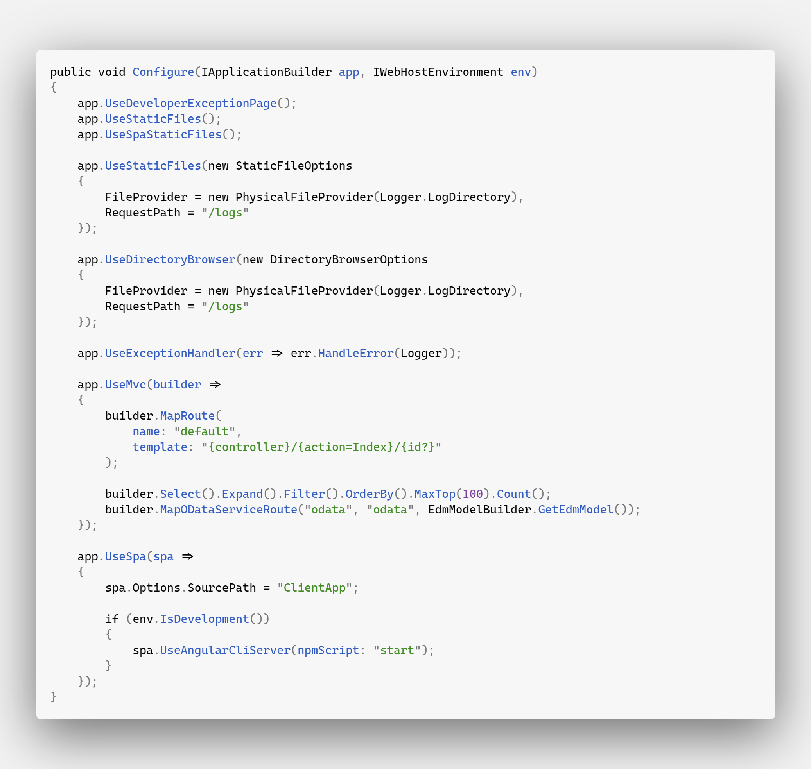
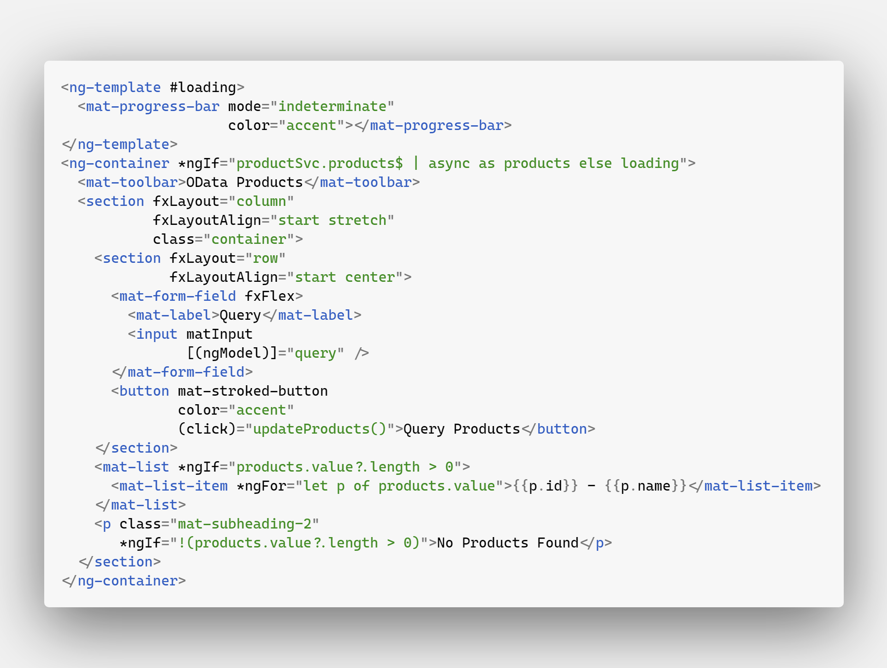

# [OData](https://www.odata.org)

**Links**  
* [OData](https://www.odata.org)
* [OData Blog](https://devblogs.microsoft.com/odata)
* [Microsoft Docs](https://docs.microsoft.com/en-us/odata)

**Notes**  
* [OData](./notes/01-odata.md)
* [Data Model](./notes/02-data-model.md)
* [URL Components](./notes/03-url-components.md)
* [Requesting Data](./notes/04-requesting-data.md)

## Build and Run

> These instructions assume that you have the infrastructure necessary to build and run a .NET Core 3.1 / Angular SPA. In addition, you will need Yarn and some flavor of SQL Server. You will also need to setup the connection strings in [**build.cmd**](./src/build.cmd) and [**appsettings.Development.json**](./src/ODataIntegration.Web/appsettings.Development.json) to match your environment.

1. Open a terminal resolved to the `./src` folder, and run `build.cmd`.
    * This will seed your database as well as build the project
2. Change directory to `ODataIntegration.Web` and execute `dotnet run`.

Here are some example OData queries:

* [localhost:5000/odata/Products/$count=true](http://localhost:5000/odata/Products?$count=true)
* [localhost:5000/odata/Products?$filter=Name ne 'Milk'](http://localhost:5000/odata/Products?$filter=Name%20ne%20%27Milk%27)
* [localhost:5000/odata/Products?$filter=Name in ('Coffee', 'Sugar', 'Milk')&$select=Name&$orderby=Name asc](http://localhost:5000/odata/Products?$filter=Name%20in%20(%27Coffee%27,%20%27Sugar%27,%20%27Milk%27)&$select=Name&$orderby=Name%20asc)

> See [OData Docs - Query options overview](https://docs.microsoft.com/en-us/odata/concepts/queryoptions-overview) for more details

## Infrastructure

> **NOTE**: Endpoint routing is [still not supported](https://github.com/OData/WebApi/issues/1748#issuecomment-568610136) yet, so have to roll back to `.AddMvc()` and `.UseMvc()` in Startup.

### Entity Framework

[**/src/ODataIntegration.Data/Entities/Product.cs**](./src/ODataIntegration.Data/Entities/Product.cs)  

[**/src/ODataIntegration.Data/AppDbContext.cs**](./src/ODataIntegration.Data/AppDbContext.cs)

[**/src/ODataIntegration.Data/Extensions/DbInitializer.cs**](./src/ODataIntegration.Data/Extensions/DbInitializer.cs)

[**/src/ODataIntegration.Data/Extensions/ProductExtensions.cs**](./src/ODataIntegration.Data/Extensions/ProductExtensions.cs)

### OData Configuration

[**/src/ODataIntegration.Data/EdmModelBuilder.cs**](./src/ODataIntegration.Data/EdmModelBuilder.cs)

[**/src/ODataIntegration.Web/Startup.cs - ConfigureServices**](./src/ODataIntegration.Web/Startup.cs)

[**/src/ODataIntegration.Web/Startup.cs - Configure**](./src/ODataIntegration.Web/Startup.cs)

[**/src/ODataIntegration.Web/Controllers/ProductsController.cs**](./src/ODataIntegration.Web/Controllers/ProductsController.cs)

### Angular

[**/src/ODataIntegration.Web/ClientApp/src/app/models/odata-result.ts**](./src/ODataIntegration.Web/ClientApp/src/app/models/odata-result.ts)

[**/src/ODataIntegration.Web/ClientApp/src/app/models/product.ts**](./src/ODataIntegration.Web/ClientApp/src/app/models/product.ts)

[**/src/ODataIntegration.Web/ClientApp/src/app/services/product.service.ts**](./src/ODataIntegration.Web/ClientApp/src/app/services/product.service.ts)

[**/src/ODataIntegration.Web/ClientApp/src/app/routes/home/home.component.ts**](./src/ODataIntegration.Web/ClientApp/src/app/routes/home/home.component.ts)

[**/src/ODataIntegration.Web/ClientApp/src/app/routes/home/home.component.html**](./src/ODataIntegration.Web/ClientApp/src/app/routes/home/home.component.html)

